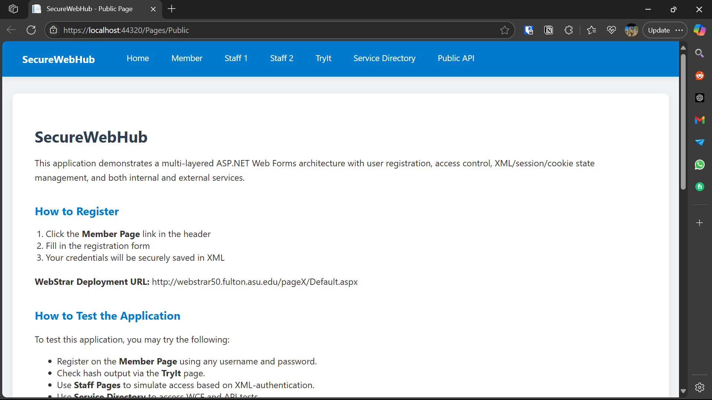
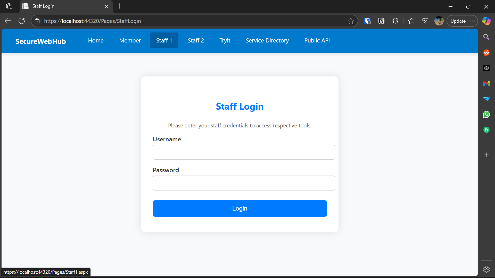
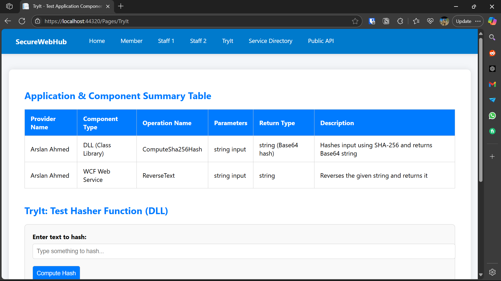
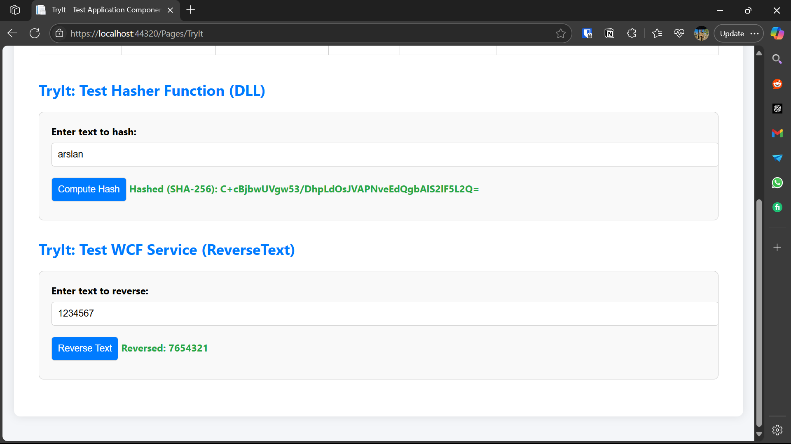

# SecureAccessPortal

An ASP.NET Web Forms application project. It includes:

- Public & Member subscription pages
- Admin/staff access with role-based control
- Custom WCF service (`MyService`) to reverse text
- Local `SHA256 hashing` using a DLL
- XML-based credential and role management
- Session and Cookie-based state management

## 💡 Technologies Used

- ASP.NET Web Forms (.NET Framework 4.7.2)
- C# Class Libraries
- WCF (Windows Communication Foundation)
- XML for data storage
- Sessions & Cookies
- Styled with basic CSS

## 🧪 TryIt Page

A page to test:

- The local `Hasher` DLL (SHA256 encryption)
- The WCF `ReverseText` Service

## 🔍 Preview

### 🧾 Public Page

### 👤 Member Signup

### 🔐 Staff Login

### 🧪 TryIt – SHA256 & ReverseText

### 😂 API Joke

## 🛠️ Setup

1. Clone the repo:

git clone https://github.com/mearslanahmed/SecureAccessPortal.git

2. Open `SecureAccessPortal.sln` in Visual Studio

3. Build and Run (Set the Web Project as Startup)

## 📌 Developer

**Arslan Ahmed**

> Software Engineer  
> Contact: arslanahmednaseem@gmail.com
